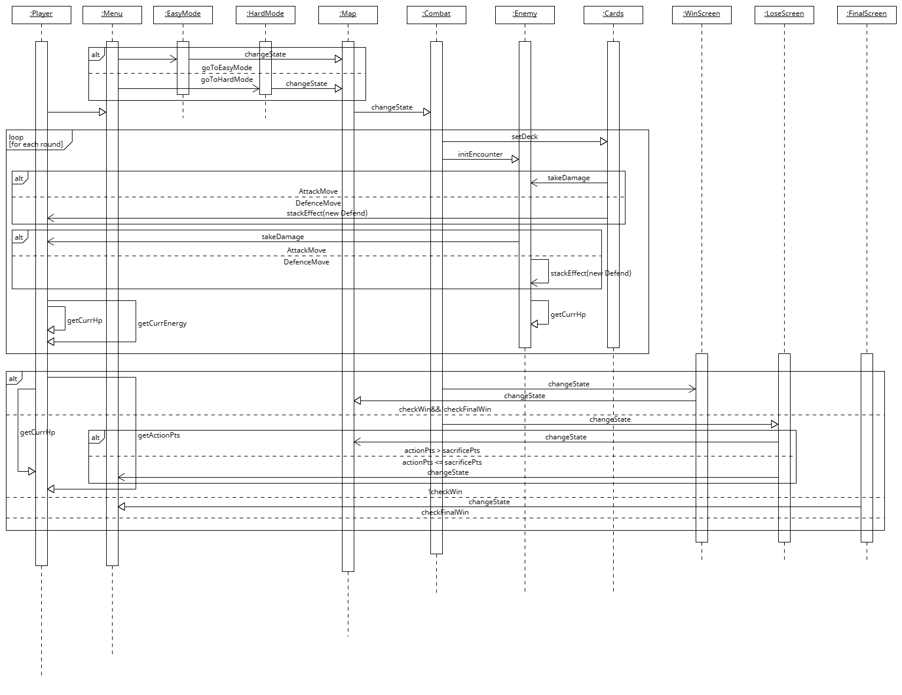

# COMSM0110 2024 Group 1

### Game Video
[](https://youtu.be/5c_nJ_hS2Og)

Click [here](https://youtu.be/5c_nJ_hS2Og) or on the image above to watch our game video!

## Group member
---

Samuel Arnold-Parra, uq23711@bristol.ac.uk, A-PS1999

Jasmine Thakral, dk23586@bristol.ac.uk, JThakral20

Zhuoli Feng, bx23489@bristol.ac.uk, erer1022

Lanai Huang, kq23993@bristol.ac.uk, Doctor-TOTORO

Ricardo Pu, kc23989@bristol.ac.uk, RicardoMiles

## Team photo
---


## Table of Contents

* [Introduction](#introduction)
* [Requirements](#requirements)
  - [Ideation](#ideation)
  - [User Stories and Use Case Diagram](#user-stories-and-use-case-diagram)
* [Design](#design)
  - [System Architecture](#system-architecture)
  - [JSON Mechanism](#json-mechanism)
  - [Class Diagram](#class-diagram)
  - [Behavioural Diagram](#behavioural-diagram)
* [Implementation](#implementation)
  - [Game Asset Handling](#game-asset-handling)
  - [Encounter Design](#encounter-design)
  - [Game State System](#game-state-system)
* [Evaluation](#evaluation)
  - [Think Aloud Evaluation](#think-aloud-evaluation)
  - [NASA TLX Evaluation](#nasa-tlx-evaluation)
  - [Game Testing](#game-testing)
* [Process](#process)
  - [Working as a Team](#working-as-a-team)
  - [Tools Used](#tools-used)
  - [Team Roles](#team-roles)
  - [Reflection on Working Together](#reflection-on-working-together)
* [Conclusion](#conclusion)

# Introduction
Our game is a turn-based and card-based game. The player begins at the bottom of a node-based map with a simple deck of cards, with the objective of reaching the top of the map and beating the final boss there. Traversing the map requires the player to engage in other combat encounters, though there are also opportunities to obtain new cards at shop nodes which can be encountered on the way.

The game is inspired by existing card-based video games like <i>Slay the Spire</i> and <i>Hearthstone</i>, with additional aesthetic inspiration coming from fantasy games and dungeon crawler classics like <i>Eye of the Beholder</i>. The game's additional twist comes from the introduction of a system
of action points which enable the player's movement on the map and which can also be spent to save the player from losing the game if they are beaten
in a combat encounter.

The game distinguishes itself in providing emergent strategic gameplay which arises as a result of the range of cards which players can obtain and the
choices made possible by the action point system. In addition, the game's controls are simple given that only mouse or trackpad clicks are required as input, making the game accessible to a broad range of users.

# Requirements

## Ideation
Our team's ideation process began with a group brainstorming session, from which two main game ideas rapidly emerged. The first was the card-based
game idea, whereas the second was a first-person dungeon crawler game in the style of games like <i>Legend of Grimrock</i>. We then went about
creating paper prototypes of both of these ideas in order to flesh out the specifics of these ideas. Creating paper prototypes was also a valuable
exercise as it helped other team members, less familiar with video games and the concepts behind the ideas, to understand them better as well.


*The paper prototype for the card-based game concept.*

[](https://www.youtube.com/watch?v=VUtbDt9KXXw)

*Right-click and select "Open link in new tab" to watch the video without leaving GitHub.*


*Additional images of the paper prototype for the card-based game*


*The paper prototype for the first person dungeon crawler idea. The nature of this concept made creating the prototype using computer tools like
LibreOffice Impress more appropriate than using literal paper.*

Having decided that we would use one of these two game ideas, we considered some of the challenges which we might face in the development of these
ideas. For the first-person dungeon crawler, the following three key challenges were identified:

1. Getting the game to render appropriately will be a challenge. In the case of 2D, it will be necessary to work out perspective maths so that
the illusion of 3D depth is created. In the case of 3D, creating a functioning camera system will be a challenge.

2. Creating smooth and appropriate transitions between game states (start screen, dungeon
traversal, combat, etc).

3. Creating a combat system with sufficient balance and depth will pose a challenge
in the development of this game idea.

Ultimately, additional research into the first-person dungeon crawler concept, in conjunction with a preliminary attempt to develop an appropriate
camera system for a 3D iteration of the idea, showed that the first-person dungeon crawler concept would likely be overly complicated to implement.
Consequently, our team decided to move forward with the card-based game concept instead. Nonetheless, as will be elaborated later in this report,
the card game concept also ran into the latter two challenges identified for the abandoned dungeon crawler game idea.

## User Stories and Use Case Diagram

Subsequently, we collaborated to create a use case diagram as a further means of solidifying our shared understanding of the game's high-level flow
and features. As our game is a single player concept, the only agent present within our use case diagram is a single player.


Though the use case diagram was useful for providing a high-level overview and an outline of the player's relationship to facets of the game, we 
found that it was not the best format for mapping out alternative/variable game flows. We found a use case specification (see below) more valuable for that purpose.

|   |Gameplay|
|---|--------|
|Description|A run through of the game, a turn-based card game for players to battle enemies in set encounters and earn action points.</br> Action points are used for movement during the game.|
|Preconditions|The player begins with a few action points.|
|<b>Basic Flow</b>|The aim is to reach and beat the boss encounter at the end, which necessitates beating enemies to collect action points and items, using them to reach the top.|
|1.|At the beginning of the game, the player chooses one of several starting points on the map.|
|2.|There will be enemies or treasures at each spot on the map. If encountering enemies, the player will have to engage in a turn-based card battle in order to obtain action points and proceed.|
|3.|Returning to the map screen, the action points obtained can be used to move to the next map space, with the possibility of spending extra points to move further.|
|4.|This flow repeats from 2 above, until the player reaches the top of the tower and wins the game.|
|<b>Alternative Flow|Illustrates the case where the player loses the game as a result of losing all their health points.|
|1.|At the beginning of the game, the player chooses one of several starting points on the map.|
|2.|In the course of play, the player loses several enemy encounters, choosing to sacrifice some of their movement points rather than health.|
|3.|Over the course of further play, the player loses further encounters. Knowing that they can't afford to lose more movement points, the player takes health damage until their health drops to 0.|
|4.|Having lost all their health points, the player is shown a game over screen and can return to the main menu.|

In addition, at this stage we brainstormed a range of user stories in order for us to keep in mind our key stakeholders and consider what goals
our game should set out to achieve. A selection of the user stories we developed are as follows:

> As a player, I want the game to have enough card variety and strategic depth so that I feel challenged and entertained.

> As a player, I want to be able to see how much health I and enemies have left so that I can make strategic decisions and feel a sense of urgency during the game.

> As a player, I want the game to have a variety of different encounters in order to keep the game fresh and provide a challenge.

> As a player, I want to be able to load the game and pick up where I left off in order to allow me to play flexibly at a time that suits me.

> As a player, I want to be able to change the difficulty of the game so that I can play the game in a way that suits my preferences.

> As a player, I want there to be help information popups/screens in the game so that I can look up information during or prior to gameplay and ensure I understand how to play the game.

# Design

## System Architecture
We knew from our concept that we would have many game interfaces, so we created the `GameState` class to manage them. Each game interface is a subclass of `GameState` and this, in conjunction with `GameEngine` (the core game system class), enabled us to implement a game loop architecture.`GameState` abstracts the different states of the game (e.g. `MapState` or `EndState`), mandating the implementation of common methods such as `setupState()`, `updateState()` and `drawState()` in each subclass. This abstraction allows us to easily extend the functionality of the game by adding new states.

The complex scene transition mechanism in our turn-based card game requires the design of multiple components:
| Class          | Responsibilities | Functions |
|----------------|------------------|-----------|
| **GameEngine** | Acts as the central management system for the game, responsible for transitioning game states, managing events, and maintaining the game loop. | - Manages the stack of GameState, allowing transitions between different states.<br>- Calls methods of the current game state to handle user input, update game logic, and render the game display.<br>- Provides a unified interface to control the start, pause, and continuation of the game. |
| **GameState**  | An abstract base class that defines the interface and behaviours that all specific game states must implement. | - Defines essential methods for game states, such as setupState(), updateState(), drawState(), handleMouseInput(), etc.<br>- Allows the GameEngine to interact with various game states through a single interface, without needing to know the details of specific states. |
| **MapState**   | Manages all elements and interactions of the map interface, one of the states where players interact most frequently with the game world. | - Displays the game map and related UI components (such as buttons and icons).<br>- Manages node objects, which may represent battles, shops, or other game events.<br>- Processes user input, updates game states, such as the selection and activation of nodes. |
| **Node**       | Represents a node on the map that can be interacted with by players. Each node has specific attributes, such as whether it can be clicked and whether it is currently active. | - Stores node status and properties.<br>- Provides methods to display itself on the map.<br>- Manages connections with other nodes, which is crucial for determining paths and implementing game logic. |
| **Button**     | Used to create and manage buttons in the game UI. Each button has its position, size, and icon, and can respond to user click events. | - Displays the button and changes state based on user interaction.<br>- Detects whether the mouse is hovering or clicking on the button, triggering corresponding actions. |
| **CombatState**| A game state class specifically dealing with player encounters with enemies in battle scenarios. | - Initialises the battle scene and enemies.<br>- Handles player mouse and keyboard inputs, allowing players to choose attacks or use specific cards.<br>- Updates the combat state, including the life points and energy of both players and enemies.<br>- Changes the game state to the EndState based on the outcome of the battle (victory or defeat). |
| **Card**       | Provides a common framework for all cards. Each specific type of card, such as attack cards, skill cards, or ability cards, inherits from this base class. | - Stores basic card information, including name, type, energy consumption, and shop cost.<br>- Defines an abstract method `applyCard(Entity target)` that needs to be specifically implemented in subclasses.<br>- Provides methods to adjust the energy consumption and shop cost of cards, as well as to obtain card status information. |
| **CardImgLoader** | Responsible for loading and storing all card images in the game. | - Loads and stores all card images at initialization.<br>- Offers a method getImg(String cardName), allowing other classes to obtain the corresponding image resource based on the card name. |


## JSON Mechanism 
We utilize custom-structured JSON files to manage our maps, enabling flexible editing and map generation. The JSON design encompasses the hierarchy of nodes on the map, their interconnections, and attributes like current node status and clickability. This facilitates interaction with Java's built-in data structures.

Since JSON files support persistent storage, we designed save&load feature. EndState updates through IO operation to JSON file. Leveraging a ```mapTemp.json``` file facilitates resource balancing between Java's garbage collection mechanism and our game's GameEngine.

We ensure a fresh start by loading default new maps using two fixed maps of varying difficulty. By evaluating the existence of ```mapTemp.json```, we update without affecting the initialization of default maps.

## Class Diagram

*A condensed version of our class diagram*

To understand how to structure our code, we developed a class diagram early in the project. This diagram initially served as a blueprint for what needed to be implemented and how tasks could be sensibly distributed among team members. Its structure evolved in line with the complexity of our game. Eventually, the class diagram matured into its [final form](https://github.com/UoB-COMSM0110/2024-group-1/blob/design-section-draft/docs/Draft%20Class%20Diagram.pdf), reflecting the changes and improvements we made as we gained more expertise in Processing.

## Behavioural Diagram
 
The `GameEngine` class is the central hub that manages transitions between various game states (e.g. `MenuState`, `MapState`, `CombatState`, `EndState`). The engine maintains a state stack to support smooth transitions and fallbacks between different game states.

At the beginning of the game, `GameEngine` initialises and pushes the `MenuState`, the player's first stage of interaction with the game. In `MenuState`, the start and difficulty selection buttons trigger a state transition to `MapState`, which also receives a reference to the top level `GameEngine` object and a newly created `Player` object as parameters.

In `MapState`, the player navigates by interacting with nodes on the map. When the player selects a node and initiates a battle, `MapState` is responsible for switching the game state to `CombatState`. In `CombatState`, the player fights against an enemy, and the result of the battle (victory or defeat) decides what happens next in `EndState`.

In `EndState`, depending on the outcome of the battle, the player may be presented with a victory or defeat screen. Winning players can freely continue, whereas losing players are faced with the choice of sacrificing action points to continue or otherwise lose the game. If the choice is to continue, the game state returns to `MapState`, allowing the player to continue exploring other nodes.

The entire process is controlled by `GameEngine`'s `changeState()` method, which controls state switching. Each state class responds to user input, updates the game logic, and draws the game interface by implementing the methods of the GameState abstract class, ensuring a coherent game and consistent experience for both users and the development team.
 

*A condensed version of our behavioural diagram* 


# Implementation

Three key challenges emerged over the course of development and the brainstorming process which preceded it. Namely, these were:

1. How to most efficiently create, load and display game assets.

2. Flexible and balanced combat/encounter design

3. How to best integrate game states together

The specifics of each challenge and how we dealt with it will be elaborated in turn.

## Game Asset Handling

The card-based nature of our game made it more asset-heavy to implement than an alternative game concept (such as a platformer) may have been.
Broadly speaking, our team's members lacked 2D art skills, posing something of a challenge to creating passable game assets.
A key aspect to how we got around this obstacle was the use of AI image generation tools, which were used to enable the rapid generation of 
assets like the main screen, combat end screen and card illustrations. 

To save time in the creation of cards, our team put together a card template using PhotoShop with layers for different parts of a card,
a move which enabled the quick iteration of new cards while maintaining a consistent format and style.


*An image highlighting the different layers of the card template .psd file*

Despite the value of AI tools for quick image generation, difficulty in using them for art direction and flaws in some of the AI generated images
meant that we did not rely exclusively on AI images for the game. Maya was used to create several combat state-related assets. Though the creation process was longer than using AI tools, it allowed the creation of a tailor-made environment which could be easily edited to meet our needs.


*A view of the 3D environment created for the battle screen's background from within Maya*

A second dimension of challenge came from loading the images. Originally each card was intended to load its own associated image. However, it became 
clear that this would cause excessive image loading. Instead we created a `CardImgLoader` class which loaded each card image only once and mapped them
to each card's name. A similar class was created for game entities. This choice reduced the previous excessive image loading, though the large number of assets nevertheless meant that some loading times were hard to avoid.

## Encounter Design

When it came to encounter and combat design, the first question our team confronted was around using procedural generation. After an initial attempt at developing the map screen procedurally, it became evident that using that approach was proving too complicated, prompting our team to opt for a hand-crafted map and encounters instead. Besides implementation complications, we also abandoned procedural generation as a consequence of
the difficulty it would have posed for consistent game balance.

Another aspect which proved challenging was how to lay out classes in a way that allowed for certain gameplay features to be implemented. Though our team had, using the class and use case diagrams, developed a good idea of the program's high level structure at an early stage, it was only after the key combat-related classes had been set up that it became clear that features like cards with effects based on the current state of combat would be a challenge to implement, as the `Card` class maintained no awareness of combat state. We were able to implement this feature by extending `CombatEncounter` to process the active card in order to calculate and apply state-related effects using a private function making use of a switch statement.

This experience highlighted the importance of planning out what features should be present in more detail prior to getting too far in
implementation.

## Game State System

As our game required various states to interact, it was important for us to develop a system which would make this possible. We opted for a stack-based
game state system, with each state receiving a reference to the top-level `GameEngine` object. This made it easier to update and pass around the 
player's data while also permitting each member of the team to work on a different state. This assisted us in dividing work and avoiding merge conflicts.
Nonetheless, this approach tested our teamwork abilities given that it required close coordination to have the states we were working on integrate together.

Tying in with encounter design, the use of JSON files for the map and JSON updating functions encapsulated in `MapState` allowed for maps to be easily updated and persisted between state transitions or even play sessions. This allowed us to easily amend game balance in line with feedback.

# Evaluation

## Think Aloud Evaluation

We collected qualitative evaluations at 3 different stages of the game. The feedback we received shaped the next few stages of development as we knew what features needed improving and which features needed to be implemented. 

### Think Aloud Evaluation 1 - Date: 2024-03-18

#### Positive Feedback
- "I really like the concept of the game."
- "The menu looks great! I love the artwork."

#### Negative Feedback
- "A tutorial for the map would be great."
- "Maybe there should be a clearer button for the player to know how to end the turn in the combat state."

#### Reflection on User Feedback
- It was clear that users did not understand how to use the map. Therefore, we created a tutorial in the Map State. 
- Users were not sure how to end a turn in the combat state. In response,we created a clearly marked ‘end turn’ button in the combat state. 

### Think Aloud Evaluation 2 - Date: 2024-04-16

#### Positive Feedback
- "The graphics look good."
- "This is a fun game!"
- "I think it’s great that you can use either the keyboard or a mouse as a control."

#### Negative Feedback
- "I think a tutorial would help."
- "The game is too easy!"
- "The yellow and red nodes at first glance look very similar as your eye is first drawn to the combat icons which are the same image."

#### Reflection on User Feedback
- Users felt unsure how to play the game. To solve this issue, we created a tutorial in the menu. 
- It was unclear how the user should start the game. We modified the menu so the flow of the game was far easier to follow. 
- Users were unsure whether they had won or lost the game. We included text in the End State to indicate this. 
- It was far too easy to win the game. We altered the game balance so that it was more challenging to defeat the enemies. We implemented a hard and an easy level. 
- Users felt that the colour of the different nodes on the map (yellow and red) on first glance looked too similar and were confusing. We changed the node colours to green and red to provide a greater contrast, making it clearer which nodes on the map were clickable. 
- It was unclear what the symbol above the enemy in the combat state meant. We therefore created a tutorial in the combat state showing the meaning of each symbol. 

### Think Aloud Evaluation 3 - Date: 2024.04.27

#### Positive Feedback
- "I think the music is catchy!"
- "I like that you can buy more cards in the shop and use them to fight the monster!"

#### Negative Feedback
- "The text after you win looks a bit squished together."

#### Reflection on User Feedback
- We modified the display of the End State so that the text was more appropriately spaced out.

## NASA TLX Evaluation

As part of gathering feedback through playtesting, we asked players to complete the NASA TLX survey. Our use of this survey was done with the goal of it helping us to refine our game's balance and ensure that there was a meaningful difference in the level of the game's difficulty between the game's easy and hard modes. We chose to use the unweighted NASA TLX scores for ease and speed of testing, and in the face of evidence suggesting that the raw TLX scores are satisfactory.


Looking at the individual dimensions, it is clear that our game scored consistently low for physical demand across both easy and hard mode. This is likely due to the simplicity of our game's control scheme. The results clearly indicate that the game's hard mode poses a greater challenge across the dimensions. This was confirmed via a comparison of the results using the Wilcoxon Signed Rank Test which found that the difference in the raw TLX scores was significant with a W-value of 0 and a p-value of approximately 0.00512.

## Game Testing

Due to the limitations of the Processing IDE, we found it challenging to conduct white-box testing. Instead, the majority of our testing was carried out using a black-box approach through playtesting to ensure the game behaved as intended. Time was spent in playtesting to consider edges cases in an effort to fix bugs. Our team did make use of print statements within sections of the code to help peek into the game's internal state and confirm that values were as expected.

# Process

## Working as a team
The team used the Software Engineering labs as well as weekly in-person meetings to check in on our progress as a team. We used these meetings to identify anything we needed to clarify or get help with. We decided as a team what the essential game states that needed to be achieved for a minimum viable product were and what other game states could be completed later on for the final version of the game. On reflection, it would have been useful to organize an in-person meeting just before the Easter holidays to ensure we all had a clear idea of what we should working on each week of the holidays.


However, we were still able to communicate this effectively throughout the holidays using WhatsApp and GitHub to ensure we all knew what needed to be achieved. In order to communicate with each other, we set up a WhatsApp group chat where we organized in-person meetings. It was also used to check in with each other to assess our progress as a group. In addition, it was used for suggesting any small tweaks that needed to be made to the project.

## Tools used
We used GitHub to host and collaborate on the project. Each member used different branches for each feature of the game i.e. using a branch specifically for the menu state. This meant we always had a working version of the game on the main branch. We set up GitHub so that nothing could be merged into main without a pull request. This was valuable as it ensured we reviewed each other's code and helped ensure we were all aligned in terms of how we wanted to implement the different features of the game. In addition, using pull requests allowed any merge conflicts to be reviewed and resolved before being pushed to the main branch.


We knew that we potentially had a game that would be relatively complex to create due to the multiple game states we needed to implement. Therefore, it was essential to use a Kanban board to keep track of all the different features we wanted to develop and ensure that they could be completed in the given timeframe of the project. As a team, we divided the workload into different features/game states that needed to be completed. We then delegated different game states to each team member. This meant that each team member had a clear idea of what they should be working on. On reflection, perhaps we could have used the Kanban board more effectively by breaking up the tasks into smaller sub-tasks. For example, creating a task for creating a shop state could have been broken up into smaller sub-tasks within this state. This would have given a greater sense of the progress that had been made.


## Team roles
We divided the workload of the game according to the different game states. Sam worked on the overall structure of the game i.e. implementing the game engine and worked on the combat state in terms of both code and related assets. Ricardo created the map state, created a template for the cards and created other assets like buttons. Lanai worked on the end state of the game. Jasmine created the shop state. Zhuoli created the main menu as well as game assets such as the cards.

## Reflection on working together
Following the project schedule of the unit, we initially concentrated on creating a minimal viable product. One of the challenges we had was getting a minimum viable prototype working. This meant that we were further behind schedule than was ideal, making it challenging to carry out user testing of the game during the software engineering labs. Instead, we resorted to presenting paper prototypes of our game to users. This meant we still received user feedback and a greater understanding of the Think Aloud and Heuristic Evaluation techniques. We were then able to use these tests later on a far more developed version of the game.

Perhaps we faced challenges with getting the minimum viable product working due to the fact that we were working on features individually. This made it more difficult to ensure smooth transitioning between the different game states. To resolve this issue, we carried out game-jam sessions, which helped us make effective progress on the game. Having an in-person session meant that we could discuss things we were unsure of so that we were more aligned on how we wanted to transition between different game states.

# Conclusion

Developing *Deck of Doom* tested us on our ability to develop software as a group and offered a look into the challenges which we might face in industry. For those of us on the team interested in pursuing game development further, it was also valuable experience in how to properly lay out a game's systems and get a prototype up and running. Overall, we are satisfied with having been able to develop a complex game architecture which provides for an engaging gameplay experience while retaining the capacity for extensibility.

Looking back over the development approach we used, our decision to split work on the game states among each team member had both positive and negative aspects. On the negative side, it initially slowed down the pace of development as certain states had to be completed before others could be tested. The need to spend some extra time and effort ensuring that all members understood how to integrate their work within the overarching system also contributed to the delay. However, on the positive side, this approach largely eliminated version control issues, allowed each team member to take ownership of a clear contribution to the project and provided ample experience for code reviews.

Overcoming the challenges we faced (creating game assets, fine-tuning game balance and integrating the game states) was done through regular team discussion via GitHub, WhatsApp and in-person meetings. Drawing on each other's areas of expertise was also critical to surmounting these obstacles, particularly in the realm of game assets, where several team members had existing skills and interests. Regarding improving game balance, user feedback through the use of the NASA Task Load Index and the System Usability Survey proved invaluable. These, alongside the Think Aloud technique, drove the next few stages of development as we knew which features needed improving and what to implement next.

We used an agile development methodology when developing *Deck of Doom*. We had iterative progress, implementing features in sprints and carrying out user testing. However, it could have been useful to use the Planning Poker technique to estimate the effort required to complete different features of the game.

On reflection, we could have dealt better with the fact that we had numerous deadlines in the same time period as the game's development. Nonetheless, through joint discussion we came to an agreement on which tasks to prioritize so that we were able to achieve our goals. In hindsight, it would have been beneficial to have arranged more 'game jam'-style development sessions earlier in the development process.

If we were to develop this game further in the future, we would be keen to create a multiplayer mode to enable players to face off against each other with their own deck. For the map state, casino-style minigames available through nodes on the map would offer an additional avenue for the player to have fun and obtain in-game money or rare cards. With more time, refactoring of the game's combat system could expand the game's strategic possibilities even further by enabling enemy behaviours and card effects which the current system cannot easily implement.

In conclusion, the project has been a success for us, from the standpoint of seeking valuable experience of team-based software engineering and developing an understanding of the Agile workflow.

