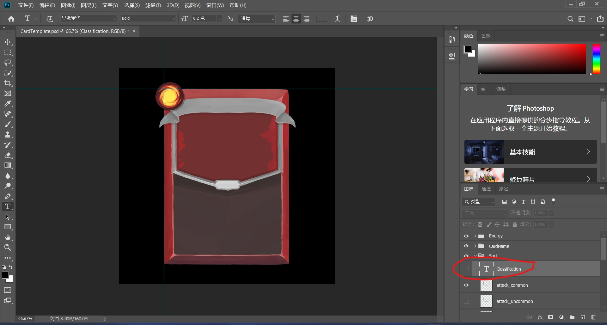
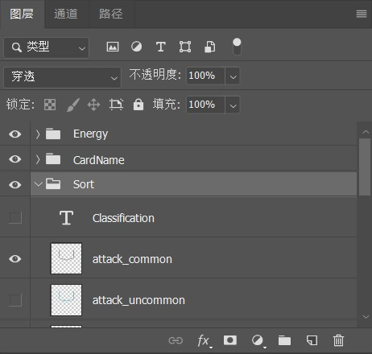

# Template File Guide

---

author: Ricardo Pu

date: 2024-02-17

last_modified_at: 2024-02-19

modified_by:Ricardo Pu

---

The .psd template file is a native Adobe Photoshop file format that supports multiple layers and imaging options. I created this template to provide our team with flexibale art assets for card UI design.

## Layers in the .PSD File

One of the key features of the .psd file is its layered structure. Each layer in a Photoshop document can hold different parts of the image, allowing for editing without affecting other elements of the image. I tried to makes it easy to adjust, add or remove components within the design.

*Blank Template when the layer invisable*

*Attack Template when clicking the layer-visable*

The text tool, indicated by the letter “T” on the left side of ps interface, can be used to change the "attack" text string.

## Layer Groups for Customization

To enhance organization and efficiency, layers in the .psd template are grouped based on their function or relation. This grouping is crucial for customization, as it allows us to easily navigate through the layers and make targeted adjustments.

*The view of the module in the bottom right corner upon entering ps.*

*Click to expand the layer group of elements*

Other layer groups follow in the same manner.

## Conclusion

The folder already contains some completed cards that could be used as art assets of our game, only for reference in other card design.

Additionallt, the sofware in illustrated images is the Simplifed-Chinese version of Adobe Photoshop. My paid copyright content only support single language，so sorry for inconvinience. But the DIY .psd template is entirely in English, including description of all of elements' name and group defination.